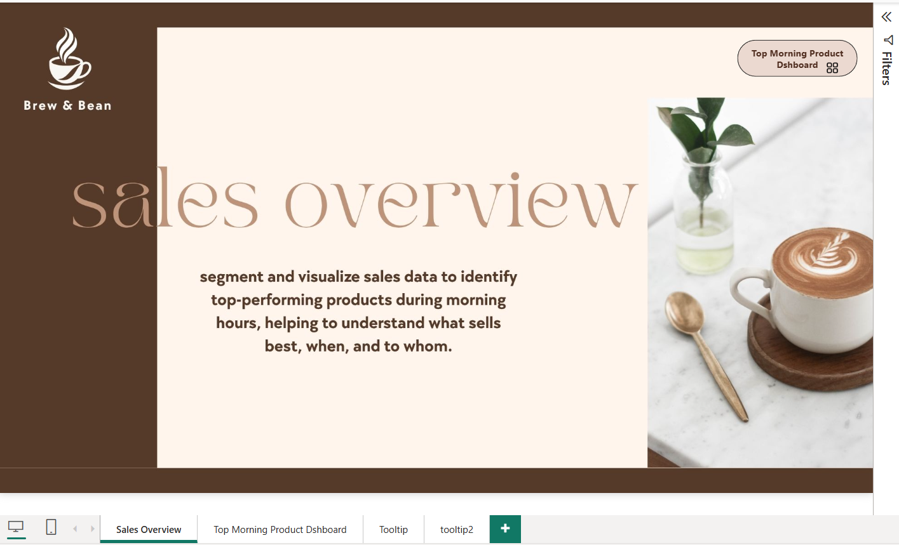
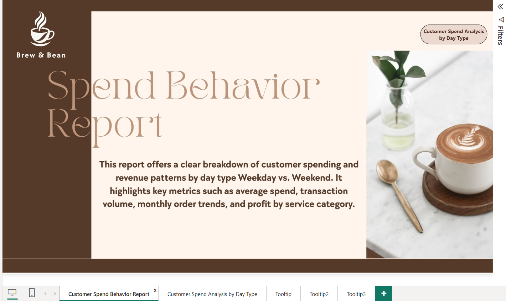
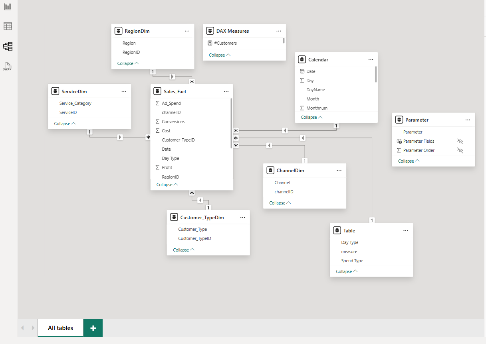

# Cafe_Sales_Analysis
This project analyzes sales data from Brew &amp; Bean Café to provide insights that help the café management understand customer behavior, optimize product offerings, and evaluate marketing campaigns. Each milestone was completed with a dedicated Power BI dashboard, making the analysis clear and visually actionable.

## Dashboards

## Top Morning Products Analysis
  Goal: Segment and visualize sales data to identify the café’s best-selling products during morning hours.
  Dashboard Highlights:
	•	Ranking of top-selling items in the morning.
	•	Contribution of each product to total morning revenue.
	•	Insights into customer preferences for breakfast and coffee items.

[Dashboard 1 - Top Morning Products](Brew%20&%20Bean%20Café.pbix)

## Weekday vs. Weekend Customer Spend
  Goal: Analyze the average spend per customer on weekdays compared to weekends.
	Dashboard Highlights:
	•	Average transaction value by day type.
	•	Customer visit patterns across weekdays vs weekends.
	•	Key insights into which days drive higher revenue and customer engagement.

[Dashboard 2 - Weekday Vs Weekend Pend](Brew-&-Bean-Café2%20(1).pbix")

## Morning Combo Campaign Impact
  Goal: Evaluate the effectiveness of the “morning combo” promotional campaigns on revenue uplift.
	Dashboard Highlights:
	•	Comparison of sales before vs after campaign launch.
	•	Uplift in revenue and customer adoption of combos.
	•	Clear visualization of campaign ROI and overall impact.

[Dashboard 3 - Morning Compo Campaign](Brew-&-Bean-Café3.pbix)
## Data Modeling

## Deliverables
 •	Cleaned and modeled dataset ready for analysis.
 •	Three interactive dashboards (one per milestone).
 •	Documentation of insights and recommendations for the café.

  
